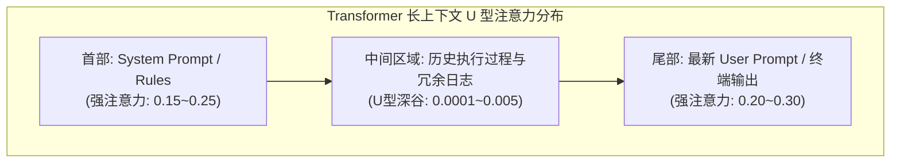
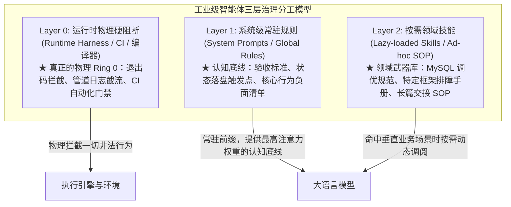
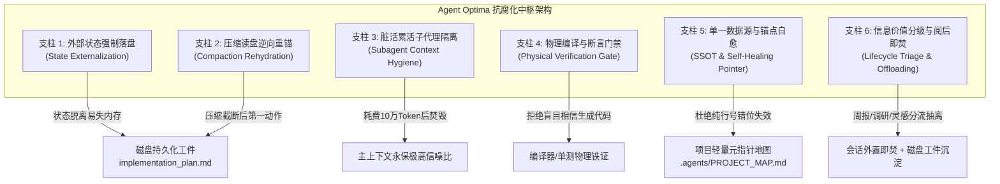
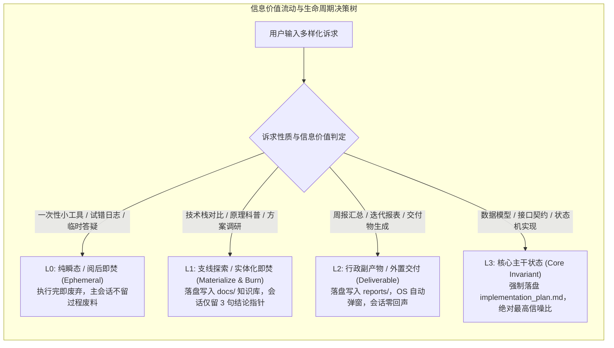

# 01. 长会话抗腐化与思维防混乱工程指南 (Context Anti-Rot & Coherence Defense)

> 深度解决 LLM Agent 在长周期、高复杂度软件研发中遭遇的“注意力衰减、记忆断层、死循环试错、逻辑自相矛盾与幻觉代码”的工业级治理白皮书。

---

## 1. 现象诊断与痛点表征 (Symptoms & Engineering Bottlenecks)

在多轮交互、重构大型系统或排查隐蔽缺陷的软件工程实战中，当单次会话进入第 10 轮以上，或上下文窗口累积至 80K~150K Token 时，工程师几乎必然遭遇 Agent 认知水平断崖式下坠的灾难。这种系统性认知崩塌在业内被称为 **“上下文腐化 (Context Rot)”**。其具体表征可精确解构为五大典型病症：

### 1.1 全局契约遗忘与架构倒退 (Contract Amnesia & Architectural Regression)
* **病症表征**：
  在会话第 1 轮明确约定的全局核心架构契约（例如：“所有接口必须返回 `{"code": 0, "msg": "ok", "data": ...}` 统一结构”、“严禁在业务逻辑中直接吞掉 `error` 并返回 `nil`”、“数据库模型必须全部显式指定 `gorm:"column:..."` 且字段禁止使用大驼峰”）。
  在第 15 轮编写新功能或修复边缘 Bug 时，Agent 将上述契约完全遗忘，重新写出原生裸 `http.ResponseWriter` 或自由发挥的 JSON 结构。
* **工程灾害**：
  系统一致性遭到严重破坏，上层调用方被破坏性破坏，制造大量架构负债。

### 1.2 错误自强化与死胡同无限打转 (Error Self-Reinforcement & The Hallucination Loop)
* **病症表征**：
  在解决一个编译报错或逻辑异常时，Agent 提出了第 1 个错误的修复假设并生成了代码；运行后终端抛出二次报错；
  随后在第 2 轮、第 3 轮交互中，Agent **没有跳出原有错误假设重新审视根因，反而将上一次失败生成的畸形代码作为“既定事实基线”，在其基础上修修补补**，越陷越深，直到代码面目全非。
* **底层机制**：
  自回归语言模型在进行概率采样时，历史上下文中出现的错误代码被当成了前置概率条件（Prior Probability）。历史失败尝试越多，错误上下文在注意力中的比重越高，模型彻底丧失自我纠错的逃逸速度。

### 1.3 压缩摘要失真与虚构事实 (Compaction Hallucination & Phantom State)
* **病症表征**：
  为了避免撑爆上下文窗口，现代 IDE 和 Agent 框架普遍具备“自动压缩（Context Compaction）”能力。当 Token 达到阈值时，系统使用轻量模型将前半段历史浓缩成一段自然语言摘要（如：*“用户与助手探讨了鉴权逻辑并对数据库查询进行了重构……”*）。
  压缩一旦触发，原有的**绝对文件路径、精确代码行号、未决任务待办状态（TODO list）、尚未验证的破坏性改动点**全部被抹杀；
* **工程灾害**：
  Agent 失去精准的工程空间坐标，开始凭借模糊记忆“脑补”接口参数，虚构不存在的文件路径或第三方依赖库，导致后续步骤全面偏航。

### 1.4 盲盒完成假象 (The Illusion of Done)
* **病症表征**：
  Agent 在回答中自信地宣称：“*重构已顺利完成，所有模块均已按照高并发安全规范重构完毕！*”
* **真实状况**：
  Agent 仅仅在编辑器中替换了文本，**根本没有在终端运行过哪怕一次编译器（`go build`、`cargo check`、`tsc`、`python -m compileall`），也没有运行任何单元测试**。用户拉取代码一跑，终端直接红屏崩溃，首行报错就是语法错误或未声明符号。

### 1.5 认知过载与指令冲突瘫痪 (Cognitive Overload & Directive Paralysis)
* **病症表征**：
  当历史会话中充满了多种不同时期的讨论草稿、被推翻的方案 A、试水但放弃的方案 B 时，Agent 面对用户的新指令开始出现“思维瘫痪”。它不知道该听从第 3 轮的决定还是第 9 轮的推翻意见，输出的代码出现逻辑割裂、首尾自相矛盾。

---

## 2. 机理剖析与根因解构 (First-Principles & Root Cause Analysis)

必须从大语言模型 Transformer 底层自注意力数学机理与现代软件工程的本质差异，进行第一性原理的深度推导。

### 2.1 Transformer 自注意力稀释与“迷失在中间” (Attention Dilution & Lost in the Middle)

根据 Transformer 标准多头自注意力机制（Multi-Head Self-Attention）：

$$\text{Attention}(Q, K, V) = \text{softmax}\left(\frac{QK^T}{\sqrt{d_k}}\right)V$$

设当前序列长度为 $N$。对于序列末尾位置的查询向量 $Q_N$，其注意力权重分布计算公式为：

$$\alpha_{N, i} = \frac{\exp\left(\frac{Q_N K_i^T}{\sqrt{d_k}}\right)}{\sum_{j=1}^N \exp\left(\frac{Q_N K_j^T}{\sqrt{d_k}}\right)} \quad (1 \le i \le N)$$

当 $N$ 从 4K 暴增至 128K 时，注意力分母 $\sum_{j=1}^N \exp(\dots)$ 急剧膨胀，导致注意力权重分布的**熵值（Attention Entropy）显著增大**：



* **位置敏感度衰减 (Primacy & Recency Bias)**：
  大语言模型对序列两端（System Prompt 与最新输入）保持极高的敏感度，但在中间长达数万甚至十数万 Token 的区间内，注意力权重跌入“U 型谷底”；
* **位置编码（RoPE 旋转位置编码）外推损失**：
  长距离相对位置编码的衰减因子使模型在跨越上百轮历史时，难以准确捕获早期的复杂状态转移约束；
* **数学结论**：
  **指望 Agent 仅凭长上下文的“自注意力记忆”在数万 Token 后依然保持对微小工程契约的准确遵循，在统计概率上是注定失败的。**

### 2.2 上下文短期内存 (RAM) 与物理磁盘 (Disk) 的定位错乱

传统 Agent 的致命架构缺陷在于：**将整个软件工程的状态机，全部托管在大模型的易失上下文窗口中（Context RAM）**。

| 计算机硬件层级 | Agent 运行时对应物 | 特性 | 传统 Agent 错误用法 | Agent Optima 正确架构 |
| :--- | :--- | :--- | :--- | :--- |
| **CPU 寄存器 / L1 缓存** | 当前轮次推理输入 (Next Token Context) | 纳秒级访问、容量极度狭小、随轮次即时刷新 | 试图在单次 Prompt 塞入全量业务背景 | 仅包含当前微任务的核心上下文 |
| **易失物理内存 (RAM)** | 多轮会话上下文历史 (Chat Context Window) | 易失性、易受污染、会话重启/压缩即丢失 | 将所有任务待办、设计文档全部存留在对话流中 | 仅作为任务执行的“暂存工作台” |
| **物理持久磁盘 (Disk)** | 本地文件系统 (`implementation_plan.md`, `git`) | 持久存储、强一致性、确定性状态机 | 完全不落盘，或者改完代码不留状态依据 | **系统真理的单一事实源 (SSOT)**，强制落盘重锚 |

**操作系统的第一法则是：易失内存用于临时运算，持久状态必须强制落盘刷入磁盘。Agent 研发工程必须彻底遵循这一法则！**

---

### 2.3 核心架构辨析：认知底线常驻、按需技能扩展与运行时物理强制分工

为什么抗腐化底线与治理规范不能完全依赖按需加载的 Skill？必须厘清大模型工程中的三个核心概念：**指令优先级（Instruction Priority）、注意力分配（Attention Allocation）与运行时程序强制执行（Runtime Hard Enforcement）**：



#### 1. 概念厘清：写在 Prompt 里的规则不是操作系统的“内核硬件中断”
- 许多人误以为只要把规则写进 `GEMINI.md` 或 `AGENTS.md`，模型就会产生像操作系统的 Ring 0 内核级硬保障。**这是对 LLM 概率采样特性的幻觉！**
- 写在任何 Prompt 里的文字，都只是模型的概率输入。**真正的物理 Ring 0 永远是外围的运行环境 Harness、编译器退出码检测、管道日志截流脚本和 CI 门禁！**

#### 2. 为什么底线治理必须进入常驻 Rules，而不能仅作为按需 Skill？
- **触发失能与认知死锁**：按需 Skill 的入口依赖模型先清醒识别出“我需要这个技能”。当长会话发生注意力稀释和意图漂移时，模型已处于认知失能状态，很难自主触发元认知去唤醒《防思维混乱 Skill》；
- **各司其职的科学架构分层**：
  - **常驻 Rules (全局认知基石)**：保持极度简炼高密度，仅包含验收门禁、何时落盘状态、命令截流参数与负面清单；
  - **按需 Skills (垂直领域工具包)**：承载长篇复杂的排错分析树、特定业务框架最佳实践；
  - **运行时工具/CI (物理绝对防线)**：负责执行真实测试命令、截流海量日志、校验退出码。

---

## 3. 架构防御与治理策略 (Architectural Defense & Strategies)

基于上述底层机理，`Agent Optima` 建立六大工程级硬核防御支柱，形成不可动摇的确定性防御网：



---

### 3.1 外部状态强制落盘 (State Externalization Protocol)

* **核心铁律**：**凡超过 3 个执行步骤的任务，严禁仅凭短期上下文“脑内记账”！**
* **落盘规范**：
  必须在专属工件路径写入计划文档（如 `<conversation_artifact_dir>/implementation_plan.md`，严禁写入项目代码库污染工作区）；
* **工业级计划模板规范**：
  ```markdown
  # [Epic 目标全称]
  
  ## 1. 架构目标与验收基线
  - 核心目标：...
  - 破坏性改动防御：...
  
  ## 2. 状态机微任务拆解与客观检验指令 (Bite-Sized Verifiable Tasks)
  - [x] **Task 1: 定义领域实体与枚举映射**
    - 涉及文件: `internal/domain/order.go`
    - 自动化检验命令: `go test -run TestOrderEnum internal/domain/...`
  - [ ] **Task 2: 实现状态机迁移核心逻辑**
    - 涉及文件: `internal/service/order_fsm.go`
    - 自动化检验命令: `go test -v -run TestOrderFSM_Transition internal/service/...`
  - [ ] **Task 3: 集成 API 与统一响应包装**
    - 涉及文件: `internal/handler/order.go`
    - 自动化检验命令: `curl -s -X POST http://localhost:8080/order/create | jq .code`
  ```
* **状态原子推进协议**：
  每当且仅当一个子任务的自动化检验命令跑出绿色通过日志后，**第一动作必须修改落盘文件的勾选状态（将 `[ ]` 更新为 `[x]`）**。这样即使会话当场崩溃，状态机在磁盘上永远处于最新确定态。

---

### 3.2 压缩读盘逆向重锚机制 (Compaction Rehydration Protocol)

* **核心铁律**：会话一旦发生系统自动上下文压缩（Compaction），**严禁凭模糊摘要幻觉推演，第一动作必须读盘重新锚定真实基线！**
* **恢复 SOP (Rehydration SOP)**：
  ```mermaid
  flowchart TD
      A["检测到会话触发上下文压缩 / 记忆截断"] --> B["严禁直接写代码 / 严禁依赖自然语言摘要推演"]
      B --> C["动作 1: view_file 读取 implementation_plan.md 真实物理进度"]
      C --> D["动作 2: 执行 git status 检验本地代码物理改动"]
      D --> E["动作 3: 执行编译器命令验证当前代码完整性"]
      E --> F["工程坐标对齐成功，恢复对下一项待办任务的执行"]
  ```
* **重锚三部曲**：
  1. **读工件进度**：使用切片 `view_file` 读取 `implementation_plan.md`，确认哪一步打了 `[x]`，当前卡在哪个未勾选的 `[ ]`；
  2. **读 Git 物理差异**：执行 `git status -s` 和 `git diff --stat`，确认真实落盘的代码到底改动了哪些文件；
  3. **读测试基线**：运行当前模块的测试命令，以客观终端输出作为思维重新启动的第一帧事实！

---

### 3.3 脏活累活子代理隔离架构 (Ephemeral Subagent Isolation)

* **核心痛点**：
  在接手大项目、全局检索代码调用链、运行庞大的集成测试套件时，往往会产生数十个文件、数千行甚至上万行的日志。若直接倾倒进主会话，主会话上下文瞬间劣化 80% 以上。
* **隔离设计准则**：
  ```mermaid
  sequenceDiagram
      autonumber
      participant Main as 主 Agent (架构把关与决策)
      participant Sub as 临时子代理 (Subagent 隔离沙盒)
      participant Workspace as 工作区与日志

      Main->>Sub: 派生独立子代理 (隔离上下文上下文窗口)
      Note over Sub: 执行大范围探索、翻看 50 个文件、执行耗时测试
      Sub->>Workspace: 产生 80,000 Token 过程数据与海量日志
      Workspace-->>Sub: 原始长篇数据
      Note over Sub: 子代理在沙盒内深度提炼消化，蒸馏核心结论
      Sub->>Main: 仅回传高纯度结论报告 (严格限制在 20 行以内)
      Note over Sub: 💥 子代理生命周期结束，沙盒连带 80K 脏数据立即销毁！
      Note over Main: 主会话始终保持极高信噪比与清爽窗口
  ```
* **回传契约规范 (Subagent Result Protocol)**：
  子代理回传给主上下文的报告**必须遵循三段式高密度结构**：
  1. `核心结论与事实判断 (Root Cause / Fact)`（最多 5 行）；
  2. `关键定位坐标 (File & Lines)`（必须带行号切片指针，如 `[auth.go:L45-L60](file://...)`）；
  3. `可执行建议 / 阻碍项 (Blockers / Next Action)`（最多 3 行）。
  坚决禁止向主会话透传大段构建日志！

---

### 3.4 物理编译与客观测试硬门禁 (Verification Evidence Gate)

* **核心铁律**：**没有客观事实证据，坚决禁止宣布任务完成！代码写完不是完成，编译通过、测试全绿、进程健康才叫完成。**
* **分阶段测试与验证覆盖率原则 (Coverage vs Noise)**：
  - 🚨 **严禁因省 Token 牺牲测试覆盖率**：过去部分团队为减少日志输出，在整个生命周期都只跑单个测试甚至禁止全量测试，这是极其危险的架构倒退！局部用例通过无法证明跨模块没有引入破坏性回归。
  - **开发阶段 (Fast Feedback Loop)**：运行定向目标用例（如 `go test -run TestTarget`、`pytest -k test_target`），获取秒级快速反馈；
  - **交付阶段 (Full Regression Gate)**：在向用户汇报或提交代码前，**必须根据改动影响面运行完整的包级/全量回归测试**（如 `go test ./...`、`pytest`）；
  - **如何化解海量日志冲击上下文？**
    **限制的是日志进入上下文的体积，而不是执行测试的范围！**
    - 推荐将测试输出重定向至临时文件，模型只读取退出码、运行总数与失败摘要：
      ```bash
      go test -v ./... > /tmp/test.log 2>&1 || (tail -n 30 /tmp/test.log && exit 1)
      ```
* **退出码与执行断言双重门禁**：
  - 门禁 1：终端退出码（Exit Code）必须为 0；
  - 门禁 2：**断言测试真实执行**：检查报告中运行测试用例数 > 0，严禁将“0 match（未匹配到任何用例）”或“全部 skipped”误判为成功！

---

### 3.5 单一数据源与轻量元指针自愈 (SSOT & Self-Healing Pointer Map)

* **核心痛点**：
  很多团队为了让 Agent 记住项目，会在 Agent 专属配置里疯狂复制业务文档。这会导致灾难性的“数据漂移”——业务代码变了，文档没变，Agent 按照老配置写出一堆废弃逻辑。
* **单一数据源原则 (Single Source of Truth, SSOT)**：
  Agent 配置中**严禁冗余存放任何业务文档正文**。业务文档必须存放在项目源码树中的 `docs/` 或 `README.md`。
* **轻量元指针地图规范 (`.agents/PROJECT_MAP.md`)**：
  在项目根目录仅维护一份超轻量的指针索引文件，大小控制在 100 行以内：
  ```markdown
  # Project Pointer Map (SSOT)
  
  - **订单核心状态机**: [docs/trade/order_fsm.md](file:///abs/path/docs/trade/order_fsm.md)
    - 锚点: `## 订单逆向退款状态流转状态机` (预估行号: L45-L120)
  - **统一错误码定义**: [internal/types/errorx/codes.go](file:///abs/path/internal/types/errorx/codes.go)
    - 锚点: `const (` (预估行号: L12-L80)
  ```
* **行号偏移自愈算法 (Self-Healing Offset Algorithm)**：
  1. Agent 通过切片工具调阅时，指定 `StartLine: 45, EndLine: 120`；
  2. 读取后第一步必须校验首行是否包含指定锚点（如 `## 订单逆向退款状态流转状态机`）；
  3. 若行号因他人提交发生漂移（未命中锚点），**立即以锚点关键字进行 `grep_search`，定位真实行号并自愈调阅**，彻底解决纯行号脆弱性！

---

### 3.6 信息价值分级与阅后即焚分流协议 (Information Lifecycle Triage & Ephemeral Offloading)

在日常工程实战中，用户与 Agent 的交互往往不仅限于纯粹的代码编写，还频繁穿插着大量**非代码开发主线的交织需求**：
- **行政与总结诉求**：编写周报、汇总提交记录、生成版本发布 Release Notes、产出测试度量报表；
- **知识与调研诉求**：讲解某框架底层运行机制、对比技术栈选型（如 ClickHouse vs StarRocks、Hyperf vs Go-Zero）；
- **发散与灵感诉求**：头脑风暴临时蹦出来的想法、未来的架构重构设想、未经论证的技术探索；
- **临时工具性诉求**：临时编写一段正则表达式、转换一个复杂 JSON 结构、解析一段异常堆栈。

#### 1. 痛点本质：多维意图交叉污染主干状态机 (Cross-Intent Context Pollution)
若将上述内容无差别地平铺在主开发会话中，会产生严重的**上下文毒化效应**：
- 数千字的周报草稿或技术栈科普文本注入后，主会话的信噪比急剧稀释；
- 依据 Transformer 自注意力 U 型衰减规律，核心业务状态机和代码契约被迅速推向注意力谷底，后续编写代码极易发生意图漂移（Goal Drift）；
- 每次微小的代码交互，都在为这些已经消费完毕的历史杂项支付二次方累积（$\mathcal{O}(N^2)$）的复利计费。

#### 2. 信息四级生命周期阶梯 (The 4-Tier Information Hierarchy)



| 级别 | 典型诉求场景 | 上下文留存策略 | 物理归宿与沉淀规范 |
| :--- | :--- | :--- | :--- |
| **L0: 纯瞬态 / 阅后即焚 (Ephemeral)** | 临时正则、JSON 格式化、试探性调试报错、一次性 Bug 修复过程 | **阅后即焚 (Burn After Reading)**<br/>禁止展开推导历史，输出结果即闭环 | 仅保留最终原子提交，海量报错日志由 Subagent 消化或即刻遗忘 |
| **L1: 支线探索 (Side-Quest)** | 技术栈对比、底层机制深度长篇解析、技术方案预研 | **实体化即焚 (Burn from Context after Materialization)**<br/>会话内禁止输出长篇科普 | 主动将调研长文落盘写入 `docs/research/xxx.md`，会话仅输出 3 句高密度结论与本地指针 |
| **L2: 行政交付 (Deliverable)** | 周报编写、Release Notes、代码统计度量报表 | **外置生成与本地弹窗 (Externalize & Auto-Preview)**<br/>严格遵守 Zero Echoing | 收集会话成果直接落盘写入 `reports/weekly-xxx.md`，执行系统命令弹窗预览，会话内仅保留 1 行指针 |
| **L3: 核心主干 (Core Invariants)** | 业务数据模型、接口契约、领域状态机、Epic 任务流 | **强一致状态机 (Persistent State)**<br/>绝对最高注意力权重 | 严格同步至 `implementation_plan.md`，作为不可动摇的单一真理源 (SSOT) |

#### 3. 灵感池分流暂存机制 (Thought Staging & Backlog Pool)
当用户在写代码间隙冒出“*我们以后可以把这个鉴权剥离成独立微服务*”或“*这里可以加个 Redis 缓存*”等非当前任务的灵感想法时：
- **严禁**：在会话中展开深入讨论发散，这会导致当前核心任务目标偏航；
- **标准 SOP**：Agent 立即将该想法提炼为 1~2 句话，自动追加沉淀到项目的轻量灵感池中（`${WORKSPACE_ROOT}/.agents/BACKLOG.md` 或 `docs/ideas.md`），并回复：
  > “💡 该想法已记录至 [BACKLOG.md](file:///path/to/BACKLOG.md)，当前保持主干聚焦，继续执行 Task 2。”

#### 4. 物理会话隔离决策建议 (Session-Level Sandboxing)
当用户提出的诉求与当前项目的代码拓扑完全无交集时（例如：“*请给我讲讲 Linux epoll 底层红黑树与就绪链表的区别*”）：
- **主动引导**：Agent 应当敏锐识别出该任务不具备代码状态机依赖，主动给出建议：
  > “*该技术调研与当前订单重构主任务上下文无直接关联。为避免数千 Token 的理论讲解稀释核心主会话的注意力并增加后续复利成本，已为您将分析报告写入 [epoll_analysis.md](file:///path/to/epoll_analysis.md) 并调起预览；或者您可以随时开启一个新会话轻装交流该理论专题。*”

---

## 4. 四大主流生态生产级实装配置 (Multi-Ecosystem Implementations)

以下配置可直接复制到对应生态工程中，立即为 Agent 披上工业级防腐化铠甲：

### 4.1 Google Gemini / Antigravity (`~/.gemini/GEMINI.md` 或项目 `.agents/rules/`)

```markdown
# 核心工程宪法防线 (Engineering Redlines)

1. 🚨 完成前铁证门禁 (Verification Evidence Gate):
   坚决杜绝“盲目假设成功”。在声称任何任务“已完成”前，必须提供终端编译器 (go build / pytest / tsc) 通过日志与客观测试绿灯证据。
2. 🚨 复杂任务状态强制落盘 (State Externalization):
   凡超过 3 个步骤的开发任务，必须在专属工件路径写入 implementation_plan.md，微任务必须附带自动化检验命令，完成一步打勾一步。
3. 🚨 会话压缩必读盘重锚 (Compaction Rehydration Gate):
   会话一旦触发系统自动压缩，严禁凭模糊摘要幻觉推演，第一动作必须 view_file 读取 implementation_plan.md 真实物理进度。
4. 🚨 海量脏数据子代理隔离 (Subagent Context Hygiene):
   涉及跨数十个文件的大范围勘测摸骨或海量测试日志，强制派生 Subagent 执行，主上下文仅接收小于 20 行的高纯度提炼结论。
```

### 4.2 Anthropic Claude Code (`CLAUDE.md`)

```markdown
# Claude Code Engineering Guidelines

## Context Anti-Rot & Safety
- **Plan First & Persist**: For tasks requiring >2 steps, initialize `plan.md` in scratchpad. Never rely on chat context memory.
- **Verification Evidence**: Never say "done" without executing terminal tests. Always provide stdout of `go test` / `pytest` / `npm test`.
- **Subagent Delegation**: Delegate broad greps and voluminous test runs to subagents. The main agent must receive summarized facts only.
- **Lost in the Middle Mitigation**: Always use targeted file reads with start/end line numbers. Never view entire files >100 lines.
```

### 4.3 OpenAI Codex / Operator (`AGENTS.md`)

```markdown
# OpenAI Agent Operational Contract

## 1. State Invariants
- Maintain atomic task progression in `task_state.json` or `implementation_plan.md`.
- Synchronize task status immediately after verification passes.

## 2. Hard Verification Gate
- Execution cannot transition to COMPLETED without zero-exit-code evidence from the project compiler.
- If a compilation or test fails, do NOT blindly tweak the same broken code. Perform root cause analysis first.
```

### 4.4 Cursor / Windsurf (`.cursor/rules/00-anti-rot.mdc`)

```yaml
---
description: 核心工程抗腐化、状态落盘与验证硬门禁
globs: ["*"]
alwaysApply: true
---

# Cursor Core Architecture Invariant

- **禁止凭空假设任务成功**：编写完代码后，必须通过终端执行编译与测试命令，验证通过后方可向用户汇报。
- **长任务必须落盘**：复杂重构必须在本地建立待办计划，拒绝单纯依赖长上下文。
- **切片调阅铁律**：阅读超过 100 行的文件时，必须使用行号范围限制，严禁全量裸读大文件。
- **杜绝死胡同试错**：若代码修改后报错，先停止修改，输出根因分析并由用户审阅后再行动。
```
