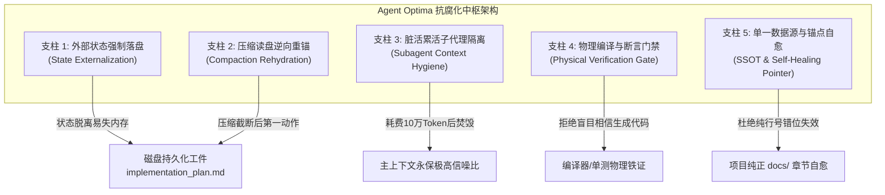

# 01. 长会话抗腐化与思维防混乱工程指南 (Context Anti-Rot & Coherence Defense)

> 深度解决 LLM Agent 在长周期、高复杂度研发任务中“注意力衰减、记忆断层、死循环试错、逻辑自相矛盾与幻觉造假”的工业级治理白皮书。

---

## 1. 现象诊断与痛点表征 (Symptoms & Engineering Bottlenecks)

在软件工程实战中，当单次会话轮次超过 10 轮，或上下文窗口累积至 80K~150K Token 时，工程师常遭遇 Agent 认知能力急剧下坠的现象，业界称之为 **“上下文腐化 (Context Rot)”**。其具体表征可精确解构为五大典型病症：

### 1.1 “前言不搭后语”与全局契约遗忘 (Contract Amnesia)
- **表征**：在会话第 1 轮明确约定的全局核心架构原则（例如：“所有接口必须返回 `{"code": 0, "msg": "ok", "data": ...}` 统一结构”、“高并发场景严禁直接加粗粒度全局 Mutex”、“Redis Key 必须携带 `{project}:{env}` 命名空间”），在第 15 轮编写新模块时被完全抛诸脑后；
- **后果**：Agent 重新退化回最平庸、未经约束的代码风格，甚至直接破坏已建立的系统契约，产生严重架构倒退。

### 1.2 上下文污染与错误自强化死循环 (Error Self-Reinforcement)
- **表征**：在排查某一隐蔽 Bug 时，Agent 提出了第 1 个错误的修复假设并失败，报错栈被打印在终端；随后 Agent 在第 2 次、第 3 次尝试中，不仅没有跳出错误思路，反而**紧紧抓住前几次失败尝试中写出的畸形代码反复微调**；
- **机理**：错误的尝试变成了上下文事实，大语言模型的自回归机制将“错误代码”作为概率采样的基线，导致在死胡同里无限打转。

### 1.3 压缩摘要失真与虚构事实 (Compaction Hallucination)
- **表征**：为了防止上下文爆满，现代 IDE 或 Agent 框架通常具备自动压缩机制（Context Compaction）。但系统生成的摘要往往是自然语言概括（如“*已修复了鉴权逻辑并讨论了数据库*”），**关键的绝对文件路径、精确代码行号、未决任务边界被大量抹去**；
- **后果**：压缩过后，Agent 失去精准坐标，开始凭模糊记忆“脑补”接口参数，自信满满地调用实际上不存在的方法或库。

### 1.4 盲盒完成假象 (The Illusion of Done)
- **表征**：Agent 输出了修改后的代码，并回复：“我已经为您成功重构了核心模块，所有逻辑均已符合规范”；
- **真实现状**：Agent 根本没有在终端运行编译器（`go build`、`tsc`、`python -m compileall`），也没有运行任何测试用例。用户实际一跑，第一行就报语法错误或类型不匹配。

### 1.5 规则碎片冲突导致的思维瘫痪 (Cognitive Overload)
- **表征**：当历史会话中充满了多种不同时期的讨论草稿时，Agent 面对新需求开始出现逻辑冲突，不知道该听从第 3 轮的决定还是第 8 轮的临时修改，输出代码逻辑首尾矛盾。

---

## 2. 机理剖析与根因解构 (First-Principles & Root Cause Analysis)

必须从大语言模型 Transformer 底层自注意力机制与软件工程物理边界进行第一性原理推导：

### 2.1 Transformer 自注意力“迷失在中间” (Lost in the Middle)
- **数学本质**：自注意力矩阵（Self-Attention Matrix）的计算复杂度为 $O(N^2)$。当 Token 数量 $N$ 扩展至 100K 以上时，注意力分布被海量历史稀释；
- **位置敏感度衰减**：大量实证研究证明，LLM 对输入序列存在严重的**“首尾偏置（Primacy & Recency Bias）”**——模型对 System Prompt（序列最前端）和用户最新输入（序列最末端）拥有最敏锐的召回率，而处于序列中间（20%~80% 区间）数万 Token 的架构决策、业务状态机与核心常量，其有效注意力权重呈现深度的“U 型谷底”；
- **结论**：**指望 Agent 仅凭长上下文记忆保持数小时前的技术约定，在数学概率上是不可靠的。**

### 2.2 上下文短期内存 (RAM) 与外部磁盘 (Disk) 的定位错乱
- 传统 Agent 的致命设计缺陷在于：**将整个软件工程的状态机，完全寄生在大模型的短期上下文窗口内（Context RAM）**；
- 软件工程本质是一个**长生命周期、强状态转移**的确定性系统。任何现代操作系统都不会只把任务状态保留在易失的物理内存中。一旦缺乏外部文件落盘，系统必崩。

### 2.3 为什么“抗腐化与上下文治理”绝不能只作为 Skill 存在？
这是很多团队设计 Agent 体系时踩过的最大架构陷阱。为什么不能把这套防御做成 `skill-anti-rot` 让 Agent 按需加载？

1. **死锁悖论 (The Deadlock Paradox)**：
   - Skill 的加载机制是“Agent 感知到需求 ➔ 执行工具读取 `SKILL.md` ➔ 装载进上下文”；
   - 但“思维混乱、注意力衰减”发生时，Agent 正处于认知失能状态。**一个已经思维混乱的 Agent，绝对不可能主动触发元认知去加载《防混乱技能》**；
2. **常驻底线 (Always-on Invariant) vs 临时知识 (Ad-hoc Knowledge)**：
   - 技能（如 MySQL 调优、Redis 锁）是局部的、可插拔的；
   - 但**“代码必须经编译器校验”、“大任务必须落盘”、“严禁全量裸读大文件”**是不可违背的**系统级宪法红线**，必须存在于 System Prompt / 全局 Rules 中，伴随每一次调用的物理输入。

---

## 3. 架构防御与治理策略 (Architectural Defense & Strategies)

基于上述底层机理，`Agent Optima` 建立五大工程级硬核防御支柱：



### 3.1 外部状态强制落盘 (State Externalization)
- **铁律**：凡超过 3 个执行步骤的复杂任务，**严禁仅凭短期上下文记忆推演**；
- **实现机制**：
  - 任务启动前，必须在专属工件路径写入计划文档（如 `<conversation_artifact_dir>/implementation_plan.md`）；
  - 必须包含：**目标背景、依赖前置条件、按序拆解的微任务列表（每个子任务附带客观自动化检验命令）、已完成/进行中/待办状态标记**；
  - 每一个子任务完成后，**立即修改磁盘文件打勾（`[x]`）**，将状态推进强制同步至物理磁盘。

### 3.2 压缩读盘逆向重锚机制 (Compaction Rehydration Protocol)
- **铁律**：会话一旦发生系统自动上下文压缩（Compaction），**严禁凭压缩摘要直接输出后续代码**；
- **恢复 SOP (Rehydration SOP)**：
  1. Agent 识别到上下文被截断/压缩；
  2. 第一动作强制调用 `view_file` 读取磁盘上的 `implementation_plan.md`；
  3. 重新确认当前处于第几步、上一阶段的检验命令输出、下一个待办目标；
  4. 恢复完毕后，再行动笔写代码。

### 3.3 脏活累活子代理阅后即焚 (Subagent Context Hygiene)
- **铁律**：跨越 5 个以上文件的大范围代码探测、数百兆日志检索或执行多轮长日志测试，**严禁在主会话中直接执行**；
- **隔离机制**：
  - 派生独立隔离的 Subagent；
  - Subagent 拥有独立的上下文空间，肆意消耗数万 Token 进行探索、翻找垃圾堆；
  - Subagent 执行完毕后自动销毁，**仅将最终提炼出的不超过 30 行结构化结论回传给主会话**；
  - 主上下文永久保持极高信噪比，自注意力机制始终聚焦在核心逻辑上。

### 3.4 物理编译与断言硬门禁 (Physical Verification Gate)
- **铁律**：在声称任何任务“已完成”或代码“已修复”前，**必须提供终端物理客观证据**；
- **破幻武器**：
  - **Go**：`go vet ./...` + `go test -run TestSpecific -v`；
  - **Python**：`python3 -m py_compile path.py` + `pytest -q -k test_target`；
  - **PHP**：`php -l path.php` + 单元测试；
  - **TypeScript/Node**：`tsc --noEmit` + `npm test`；
- 没有看到退出码为 `0` 的终端日志，严禁向用户宣称完工。

### 3.5 单一数据源与语义章节锚点自愈 (SSOT & Self-Healing Pointer)
- **铁律**：严禁在 Agent 专属笔记或配置中冗余拷贝项目的业务文档正文（防止数据漂移）；
- **指针自愈规范**：
  - 项目根目录建立轻量指针元地图：`${WORKSPACE_ROOT}/.agents/PROJECT_MAP.md`；
  - 指针强制采用 **“Markdown 章节语义锚点为主 + 预估行号区间为辅”**（如 `[order.md#3.1-状态机](path/to/order.md#3.1-状态机) (约 L45-L90，核心锚点: ## 3.1 状态机)`）；
  - 调阅切片时，若行号因他人修改发生偏移未命中锚点，Agent 必须通过快速关键字检索该锚点并动态校准切片，实现 **0 误差自愈**。

---

## 4. 多生态跨端落地实现 (Cross-Agent Implementation Matrix)

### 4.1 Google Gemini / Antigravity (agy) 落地方案

在全局总纲 `~/.gemini/GEMINI.md` 的 `3. 核心工程铁律` 中写入宪法红线：

```markdown
# 核心工程铁律 (Engineering Redlines)
1. 完成前铁证门禁 (Verification Evidence Gate)：
   - 坚决杜绝“盲目假设成功”。在声称任务完成前，必须提供客观证据（测试通过、编译无报错）。没有事实证据，绝不轻言完成。
2. 复杂任务状态强制落盘 (State Externalization)：
   - 超过 3 步的复杂任务，必须将拆解步骤与校验指令落盘至 <conversation_artifact_dir>/implementation_plan.md，进度实时刷盘。
3. 会话压缩必读盘重锚 (Compaction Rehydration Gate)：
   - 会话一旦触发系统自动压缩，严禁凭模糊摘要推演，第一动作必须读盘重新锚定真实基线与待办进度。
4. 海量脏数据子代理隔离 (Context Hygiene via Subagent)：
   - 凡涉及跨数十个文件的大范围勘测摸骨或长篇测试，强制派生 Subagent 独立执行，主上下文仅接收高密度结论。
5. 项目知识指针引用铁律 (Pointer Over Duplication)：
   - 统一在 ${WORKSPACE_ROOT}/.agents/PROJECT_MAP.md 中维护轻量元指针，以章节语义锚点为主精准切片调阅，严禁冗余拷贝正文。
```

---

### 4.2 Anthropic Claude Code 落地方案

在项目根目录 `CLAUDE.md` 中注入长会话防御指令：

```markdown
# Context Coherence & Anti-Rot Rules

## 1. External State Anchor
- For any task involving >3 files or >2 steps, maintain `.claude/plan.md`.
- Mark milestones completed immediately upon physical verification.
- NEVER rely solely on conversation memory across multi-turn interactions.

## 2. Compaction Recovery SOP
- When the context window undergoes summarization/compaction:
  1. STOP all immediate code modifications.
  2. Read `.claude/plan.md` to re-align on target, constraints, and current step.
  3. Resume execution strictly from the external plan state.

## 3. Deep Reconnaissance Hygiene
- When exploring codebase architecture or scanning multiple log files:
  - Delegate the task to a subordinate subagent.
  - Return ONLY concise, distilled architectural findings (under 25 lines) to main conversation.

## 4. Physical Assertion Gate
- Run appropriate test/compiler command before claiming completion:
  - Go: `go test -v -run <TargetTest>`
  - Python: `pytest -q <test_file>`
  - TS: `npm run build` or `npx tsc --noEmit`
```

---

### 4.3 OpenAI Codex / Operator 落地方案

在 System Prompt / Instructions 中配置结构化状态断言：

```markdown
## Behavioral Constitution: Context Integrity & Reliability

### 1. State Externalization
You must operate as a deterministic state machine:
- Maintain a structured `scratchpad.md` in the working environment for complex workflows.
- Update task status (`[PENDING]`, `[IN_PROGRESS]`, `[VERIFIED]`) explicitly on disk.
- If memory context becomes fragmented or truncated, reload `scratchpad.md` first.

### 2. Zero Unverified Assumptions
- Never assume a code edit succeeded without execution evidence.
- Always execute terminal verification commands (syntax check, linter, tests).
- If an error occurs, inspect the root cause. Do NOT blindly repeat prior failed code blocks.

### 3. Context Conservation
- Do not dump multi-page terminal outputs into conversation.
- Use grep/head/tail to isolate relevant diagnostic lines.
```

---

### 4.4 Cursor / Windsurf 落地方案

在工作区建立 `.cursor/rules/session-anti-rot.mdc` 规则文件：

```markdown
---
description: 长周期编码防失忆与状态落盘门禁
globs: **/*
alwaysApply: true
---

# Anti-Rot & Verification Redlines

1. State Tracking:
   - For multi-step refactoring, create/update `.cursor/TODO.md`.
   - Never keep checklist only in chat history.

2. Blast Radius Control:
   - Make atomic changes only. Never reformat or rewrite entire files.
   - Use targeted symbol navigation instead of scrolling entire codebase.

3. Assertion Gate:
   - Run linter/build diagnostics via terminal before declaring a feature complete.
   - If tests fail, diagnose the root cause instead of hallucinating workaround fallbacks.
```
