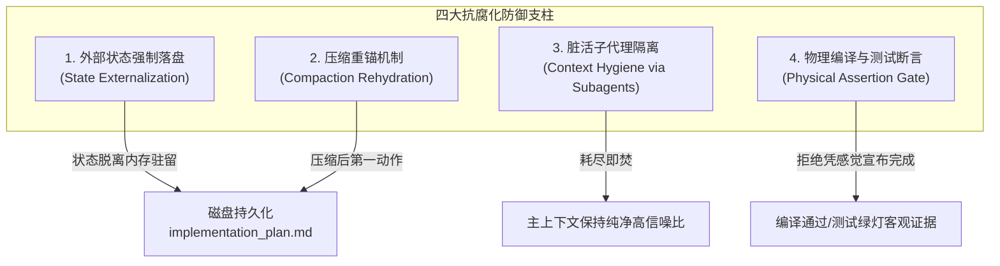

# 01. 长会话抗腐化与思维防混乱工程指南 (Context Anti-Rot & Coherence Defense)

> 深度解决 LLM Agent 在长周期、高复杂度研发任务中“注意力衰减、记忆失忆、逻辑自相矛盾与幻觉代码”的工业级治理方案。

---

## 1. 现象诊断与痛点表征 (Symptoms & Engineering Bottlenecks)

在研发周期超过 3 个轮次或会话 Token 超过 80K~100K 时，工程师常观察到以下典型“发疯”表征：

1. **“前言不搭后语”与架构原则遗忘**：开局明确约定的“全局统一错误码返回”、“并发安全防竞态”、“环境隔离命名空间”，在长会话中后期被彻底抛诸脑后，Agent 重新退化回最原始的初级代码写法；
2. **上下文污染导致死循环推导 (Context Poisoning)**：排查某一 Bug 时经历了 3 次失败尝试，遗留的报错日志与错误代码块被 Agent 误当成“现有真理”，并在后续修改中反复围绕错误方向打转；
3. **压缩摘要失真 (Compaction Hallucination)**：系统触发自动上下文压缩后，生成的自然语言摘要丢失了关键行号、真实版本号与未决任务边界，Agent 凭“模糊记忆”自圆其说、虚构事实；
4. **代码盲盒假设 (No Verification Illusion)**：写完代码即声称“已完美修复”，实则未经编译，一跑报错。

---

## 2. 机理剖析与根因解构 (First-Principles & Root Cause Analysis)

### 2.1 Transformer 自注意力衰减与“迷失在中间 (Lost in the Middle)”
- Transformer 的自注意力矩阵计算具备天生的**两端权重偏差**：模型对 System Prompt（最开头）与最新一轮用户输入（最末尾）具备极高注意力，但对中间数万 Token 的技术细节、推导结论的检索与召回率呈“U 型谷底”；
- 随着上下文逼近 128K~200K，注意力被海量历史稀释，早期的设计决策在数学概率上被淹没。

### 2.2 上下文污染与错误自强化 (Context Contamination)
- 语言模型的本质是根据上下文预测下一个 Token。上下文不仅包含你的指令，还包含失败的尝试、终端的大段报错。
- 当“脏上下文”的体量远超过“干净代码”时，模型在概率分布上会倾向于模仿脏上下文中的错误范式，导致“越改越烂”。

### 2.3 状态仅驻留于短期 RAM 的架构缺陷
- 绝大多数初级 Agent 仅把任务状态保存在模型的**短期上下文（Context RAM）**中。一旦会话被截断、压缩或重启，状态即刻灰飞烟灭。

---

## 3. 架构防御与治理策略 (Architectural Defense & Strategies)

为终结上述机理，`Agent Optima` 确立四大架构防线：



### 3.1 外部状态强制落盘 (State Externalization)
- **铁律**：超过 3 个步骤的复杂开发或重构，严禁脑内记账；
- **实现**：强制先在专用工件文件（如会话专属目录的 `implementation_plan.md`）中落盘：任务背景、待办步骤、每一步的验证指令与当前执行标记；
- **价值**：状态物理固化在磁盘，模型随时可重读，不依赖衰减的注意力。

### 3.2 压缩重锚机制 (Compaction Rehydration Gate)
- **协议**：会话一旦发生系统自动 Compaction，**严禁凭摘要推演**；
- **动作**：Agent 的第一动作必须是读取磁盘上的方案与进度文件重新激活真实基线。

### 3.3 脏活累活子代理隔离 (Context Hygiene via Subagent)
- **协议**：跨数十个文件的大范围勘测、海量构建日志排查、多轮测试，**强制派生 Subagent**；
- **价值**：Subagent 消耗 10 万 Token 后随销毁而释放，主上下文仅接收其浓缩后的 20 行结论，彻底切断上下文污染链条。

### 3.4 物理编译与断言门禁 (Physical Assertion Gate)
- **协议**：没有事实证据（编译无报错、单测通过、语法检查通过），绝不轻言完成；
- **价值**：用底层的编译器（`go vet`, `mypy`, `tsc`, `php -l`）作为终极破幻武器，将 Agent 强行拉回现实世界。

---

## 4. 多生态跨端落地实现 (Cross-Agent Implementation Matrix)

### 4.1 Google Gemini / agy (Antigravity) 落地
在 `~/.gemini/GEMINI.md` 注入绝命禁区铁律：
```markdown
# 核心工程铁律
1. 复杂任务状态强制落盘：微任务拆解必须落盘至 <conversation_artifact_dir>/implementation_plan.md；
2. 会话压缩必读盘重锚：一旦触发 Compaction，第一动作必读盘锚定待办进度；
3. 海量脏数据子代理隔离：大范围勘测摸骨强制派生 Subagent，主记忆保持极高信噪比；
4. 完成前铁证门禁：必须提供客观测试/编译日志证据，拒绝盲目假设成功。
```

### 4.2 Anthropic Claude Code 落地
在 `CLAUDE.md` 与会话启动参数中固化：
```markdown
## Session Integrity & Coherence
- Never keep state only in memory. Write milestones to `.claude/plan.md`.
- After context compaction, read `.claude/plan.md` before executing new actions.
- For broad codebase exploration (>5 files), spawn a subagent to report high-level summary only.
- Run tests (`pytest -q` / `go test`) before marking any milestone done.
```

### 4.3 OpenAI Codex / Operator 落地
在 System Instruction 中增加断言防御：
```markdown
## Anti-Hallucination & State Anchoring
- When handling multi-step tasks, create and maintain `todo.md` in the working environment.
- Verify every code change using language compilers or unit tests in the execution sandbox.
- Summarize tool outputs concisely; do not retain full terminal logs in conversation turns.
```

### 4.4 Cursor / Windsurf 落地
在 `.cursor/rules/session-coherence.mdc` 规范中配置：
```markdown
---
description: 长会话抗腐化与任务状态锚定规则
globs: **/*
alwaysApply: true
---
- When tackling multi-file refactoring, maintain a `TODO.md` checklist at workspace root.
- Check off items upon physical verification (lint/build success).
- Never format or edit unrelated code to avoid context blast radius.
```
