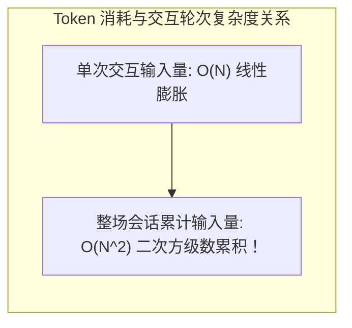
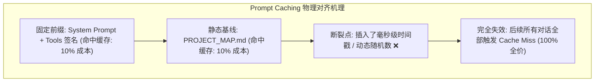
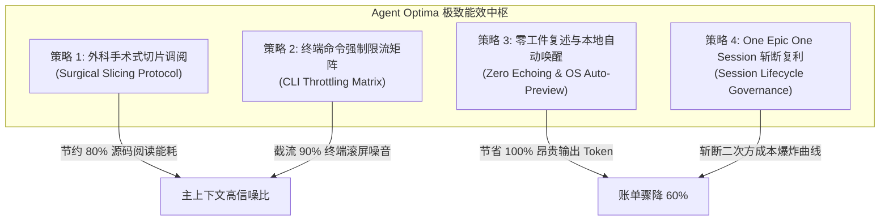

# 02. Token 极致能效与零损耗降本手册 (Token Efficiency & Cost Optimization)

> 从底层计费公式、Transformer 缓存前缀物理机理到终端截流协议，构建大语言模型 Agent 研发过程中兼顾“顶尖质量与极致能效”的工业级降本指南。

---

## 1. 现象诊断与痛点表征 (Symptoms & High-Cost Anti-Patterns)

在许多开发团队的日常 Agent 实践中，常出现“几天内数千万 Token 蒸发、API 账单飙升、模型响应越来越慢”的严峻问题。深入剖析会话历史与调用链路，可以精确归结为四大高能耗反模式：

### 1.1 贪婪裸读巨型文件 (Naive Full-File Ingestion)
* **典型反模式**：
  Agent 为了定位某个方法中 3 行参数定义，直接对一个拥有 2,500 行的 `schema.prisma`、`models.py` 或 `api.go` 执行了全量文件读取；
* **能耗灾难**：
  单次读取瞬间向上下文注入 15,000 ~ 20,000 Token。在后续多轮对话中，这 20,000 Token 充当了长达十几轮的冗余“历史包袱”，每次推理都会被重复计费，导致数百万无效 Token 消耗。

### 1.2 终端海量滚屏日志冲垮窗口 (Terminal Log Overflow)
* **典型反模式**：
  在排查 Git 历史、构建前端或执行测试时，Agent 执行了没有限制的裸命令（例如 `git log`、`npm run build`、`go test -v ./...`），导致终端倾泻数千行日志；
* **能耗灾难**：
  大量的编译进度条字符、无用测试通过明细（`PASS`）和冗余路径信息冲垮上下文窗口，瞬间吃掉 30,000+ Token，直接加速触发会话强制压缩。

### 1.3 昂贵输出回声与工件二次复述 (The Expensive Artifact Echo Trap)
* **典型反模式**：
  Agent 在通过文件写入工具生成了一份详尽的 300 行系统设计文档或迁移方案后，**在随后的聊天回复框中，又将这 300 行 Markdown 从头到尾完整敲了一遍**；
* **能耗灾难**：
  主流商用大模型中，**输出 Token (Output Token) 的单价普遍是输入 Token 的 3 到 5 倍**，且输出 Token 受限于自回归串行采样解码机制，不仅耗费巨额资金，更让用户在终端前经历数十秒极其痛苦的等待。

### 1.4 无限长会话引发的二次方复利雪崩 (The Quadratic Snowball Avalanche)
* **典型反模式**：
  工程师在一个会话窗口中连续工作两周，横跨“需求调研 ➔ 架构设计 ➔ 业务编码 ➔ 缺陷修复 ➔ 运维部署”全流程。历史上下文长期堆积在 150K~180K 的极高水位；
* **能耗灾难**：
  用户即使只输入一句简单的“*帮我给这个函数加个注释*”，模型在底层也必须对整整 180K 的历史上下文执行一次全量自注意力扫描，使得每一次简单互动的边际成本呈指数级恶化。

---

## 2. 机理剖析与根因解构 (First-Principles & Mathematical Models)

必须从大模型计费公式、注意力前缀缓存机制（Prompt Caching）与计算复杂度进行严格推导。

### 2.1 长会话 Token 二次方累积数学模型与综合计费公式

设用户在一次任务中与 Agent 进行了 $N$ 轮交互：
* 设系统初始 Prompt（System Prompt + Tools 契约）基础长度为 $I_0$；
* 设在第 $j$ 轮交互中，用户的输入加上终端工具返回的输出增量为 $\Delta I_j$；
* 设第 $j$ 轮 Agent 生成的回复 Token 数量为 $O_j$；

在传统的全量历史传递架构中，第 $k$ 轮推理时，送入大模型的**输入上下文总量 $I_k$ 随轮次呈线性增长**：

$$I_k = I_0 + \sum_{j=1}^{k-1} \left( \Delta I_j + O_j \right) = \mathcal{O}(k \cdot \bar{M})$$

整场会话经过 $N$ 轮交互后，用户支付的**累计总输入 Token** $\text{Tokens}_{\text{in-total}}$ 为每一轮输入量的离散级数和：

$$\text{Tokens}_{\text{in-total}} = \sum_{k=1}^N I_k = N \cdot I_0 + \sum_{k=1}^N \sum_{j=1}^{k-1} \left( \Delta I_j + O_j \right) = N \cdot I_0 + \bar{M} \cdot \frac{N(N - 1)}{2} = \mathcal{O}\left( N^2 \cdot \bar{M} \right)$$



* **数学推导结论**：
  **多轮长会话的单轮输入呈线性增长，而整场会话的累计输入 Token 呈二次方（$\mathcal{O}(N^2)$）级数膨胀！**
* **工业级真实总费用核算口径**：
  在引入 Prompt Caching（缓存）与工具调用的真实生产环境中，实际费用应遵循综合度量公式：
  
  $$\text{Total Cost} = C_{\text{uncached}} \cdot T_{\text{uncached-in}} + C_{\text{cached}} \cdot T_{\text{cached-in}} + C_{\text{write}} \cdot T_{\text{cache-write}} + C_{\text{out}} \cdot T_{\text{out}} + \text{Cost}_{\text{tools}}$$

* **“状态落盘”计费边界澄清**：
  必须理性认识到：当模型调用工具向文件写入内容时，**写入工具的输入参数本身仍属于模型的输出 Token，按 Output 费率计费**；
  落盘真正节省的是：**在后续多轮交互中，不必在上下文历史中反复携带这数千字正文进行二次方复利计费，以及免去在对话聊天框中二次吐出长篇 Markdown 的巨额浪费**。

---

### 2.2 输出与输入 Token 价格非对称经济学 (Asymmetric Token Economics)

以业界主流顶级模型（如 Claude 3.5 Sonnet / GPT-4o）为例：
* 输入 Token 单价：约 $\$3.00 \text{ / } 1\text{M tokens}$；
* 输出 Token 单价：约 $\$15.00 \text{ / } 1\text{M tokens}$（**单价贵 500%！**）；
* 解码速度差异：输入是高度并行的矩阵乘法运算（毫秒级吞吐成千上万 Token）；输出是串行自回归逐 Token 采样，硬件显存带宽受限，吞吐仅 40~80 tokens/sec。

> **经济学铁律**：**在聊天流中无意义地打印出几百行代码或工件正文，是在用昂贵 5 倍的真金白银，换取极差的终端交互延迟！**

---

### 2.3 Prompt Caching (KV Cache) 物理对齐机理与前缀失效反模式

现代云端大模型普遍引入了 Prompt Caching（上下文缓存）机制：对历史中完全一致的前缀块（Prefix Tokens），直接复用显存中已经计算好的 KV Cache，可带来 **90% 的计费折扣与 80% 的首字延迟（TTFT）降低**。



* **前缀一致性铁律 (Prefix Alignment)**：
  KV Cache 必须从物理序列的第 0 字节开始严格按块（通常每 1,024 Token 为一块）向后匹配；
* **断裂点反模式 (The Cache Busting Bug)**：
  若在系统 Prompt 或每次工具调用的最前面擅自加入了 `Current Timestamp: 2026-09-18 17:05:32.145` 或动态变化的临时环境变量，会导致**从该点往后的所有历史上下文全部 Cache Miss，当场丧失 90% 降本红利**！

---

## 3. 架构防御与落地策略 (Architectural Defense & Strategies)

基于上述底层机理，`Agent Optima` 构建四大硬核节流策略：



---

### 3.1 外科手术式切片调阅协议 (Surgical Slicing Protocol)

* **核心原则：语义单元优先，预算上限防御**：
  - 🚨 **拒绝盲人摸象式机械截断**：避免机械死卡 30~80 行导致跨行函数、复杂事务边界或异常处理链条被截断，进而引发多次补读与误判；
  - **标准两步检索 SOP**：
    1. **搜索定位 (Search First)**：先通过 `grep_search` / `rg` 锁定目标符号行号；
    2. **完整语义单元调阅 (Semantic Slicing)**：依据函数/类起止边界，按完整的语义块调阅（例如一个 120 行的支付处理函数，应一次性完整调阅其完整闭包）；
    3. **预算上限控制**：对于小型文件（<150 行）或全局架构文件，直接全量阅读；对于超大型文件（数千行），设置单次 Token 预算上限（如 150 行或 4KB），严禁无目的盲目裸读全文件。

---

### 3.2 终端命令强制限流与日志重定向截流 (CLI Log Redirection & Throttling)

* **核心铁律**：**严禁为了省 Token 阉割必要的测试覆盖率！限制的是日志进入上下文的体积，而不是执行测试的范围！**
* **日志截流方案**：
  - 在运行可能产生海量滚屏的命令（如全量回归测试 `go test ./...`）时，**采用重定向到临时文件 + 提取退出码与失败摘要**：
    ```bash
    go test -v ./... > /tmp/test.log 2>&1 || (tail -n 40 /tmp/test.log && exit 1)
    ```
* **高频命令限流矩阵对照表**：

| 命令分类 | 危险高能耗裸跑命令 ❌ | 稳健限流截流规范 ✅ | 治理目标 |
| :--- | :--- | :--- | :--- |
| **Git 日志** | `git log` / `git log -p` | `git log -n 5 --oneline` / `git diff --stat` | 限制输出行数，避免巨量提交历史滚屏 |
| **目录勘测** | `find .` / `tree` | `tree -L 2 -I 'node_modules\|vendor\|.git'` | 限制层级深度，屏蔽海量依赖目录 |
| **开发期微测** | 盲目全量跑单测 | `go test -run TestTarget` / `pytest -k test_name` | 开发调试期秒级快速反馈 |
| **交付前回归** | ❌ 阉割为只测单函数 | `go test ./... > /tmp/run.log` + 提取失败行 | **必须保持 100% 回归覆盖率**，仅截流日志 |
| **包管理安装** | `npm install` / `pip install` | `npm i --silent` / `pip install -q` | 屏蔽无意义的下载进度条字符 |
| **日志排查** | `cat error.log` | `grep -n -C 3 "ERROR" error.log \| tail -n 30` | 精准定位错误堆栈，禁止全量 cat |

---

### 3.3 零工件复述与 OS 级本地自动唤醒 (Zero Artifact Echoing & OS Auto-Preview)

* **核心铁律**：
  在创建或更新了本地工件（如设计方案、复盘文档、系统架构图）后，**严禁在随后的对话回复流中原样把 Markdown 打出来！**
* **对话流极简指引规范**：
  对话回复仅需输出标准可点击链接与核心要点：
  ```markdown
  👉 方案已沉淀至工件：[implementation_plan.md](file:///abs/path/implementation_plan.md)
  
  已通过系统命令自动调起本地预览，请审阅以下 2 个关键决策点：
  1. 鉴权中间件超时阈值建议由 5s 下调至 2s；
  2. 订单状态机新增 REFUNDING 状态。
  ```
* **跨平台本地自动唤醒机制**：
  在纯 CLI 环境（如 agy / claude terminal）下，Agent 在落盘文件后，必须主动执行系统命令调起本地渲染软件，彻底免去用户手动敲命令打开的繁琐摩擦：
  - **macOS**：
    优先执行：`open -a Typora <filepath>` 或 `open -a "Google Chrome" <filepath>`（已装 Markdown Preview 插件）；
    兜底执行：`open <filepath>`；
  - **Linux**：`xdg-open <filepath>`；
  - **Windows**：`start <filepath>`。

---

### 3.4 会话生命周期治理：One Epic, One Session 机制

* **核心哲学**：
  **永远不要把一个会话当成永不退役的日记本。会话的本质是短命的、专注的计算沙盒。**
* **生命周期跃迁规则**：
  ```mermaid
flowchart LR
    S1["启动新会话 (基线: 3K Token)"] 
    --> S2["勘测摸骨与设计方案"]
    --> S3["原子化实现与测试验证"]
    --> S4["物理测试全绿 + 提交"]
    --> S5["推送远端并沉淀文档"]
    --> S6["归档并开启新会话承接下一个 Epic"]
```
* **效益分析**：
  通过将大 Epic 拆解并“完成即提交、提交即开启新会话”，把原本在 150K 水位滑行的二次方成本曲线（$\mathcal{O}(N^2)$），重置为多个仅在 3K~25K 之间波动的平缓线性阶梯，**综合 API 费用直接下降 60% 以上**！

---

## 4. 多生态生产级实装配置代码 (Multi-Ecosystem Configuration)

### 4.1 Google Gemini / Antigravity (`~/.gemini/GEMINI.md`)

```markdown
# 能效与 Token 治理宪法 (Token Efficiency Redlines)

1. 🚨 外科手术式调阅与限流 (Surgical Slicing & Throttling):
   - 严禁全量裸读大文件：面对超过 100 行的文件，坚决禁止无行号 view_file；必须先 grep 定位，再将阅读窗口精确收敛在 30~80 行。
   - 终端命令限流：执行命令必须强制附加静默与限流参数 (git log -n 5, tree -L 2, pytest -q)。
2. 🚨 严禁聊天流复述工件正文 (Zero Artifact Echoing):
   - 创建或更新工件后，严禁在对话回复中原样复述 Markdown 正文；
   - 仅需输出标准可点击指针，并在 macOS 下主动执行 open -a Typora <path> 或 open -a "Google Chrome" <path> 为用户唤起弹窗预览。
```

### 4.2 Anthropic Claude Code (`CLAUDE.md`)

```markdown
# Claude Code Efficiency Protocols

## Token Optimization
- **Never cat large files**: Always use `grep` or slice commands (`sed -n '10,50p'`).
- **Command Output Control**: Always limit output (e.g. `git log -n 5`, `head -n 20`).
- **Zero Echoing**: After creating a file with write tool, do not echo file contents in markdown response. Just provide the path.
- **Session Reset**: Encourage user to run `/compact` or start new session after completing each major feature.
```

### 4.3 Cursor / Windsurf (`.cursor/rules/01-token-optima.mdc`)

```yaml
---
description: Token 能效极致优化、外科手术切片与命令限流
globs: ["*"]
alwaysApply: true
---

# Cursor Token Optimization Rule

- **阅读文件规范**：严禁全量读取超过 100 行的文件。必须按行号切片。
- **终端执行规范**：禁止裸跑大篇幅测试命令，统一附加静默/单测过滤参数。
- **输出洁癖**：严禁在回答中原样复述已经写入文件的代码或文档，仅输出差异点与决策结论。
```
