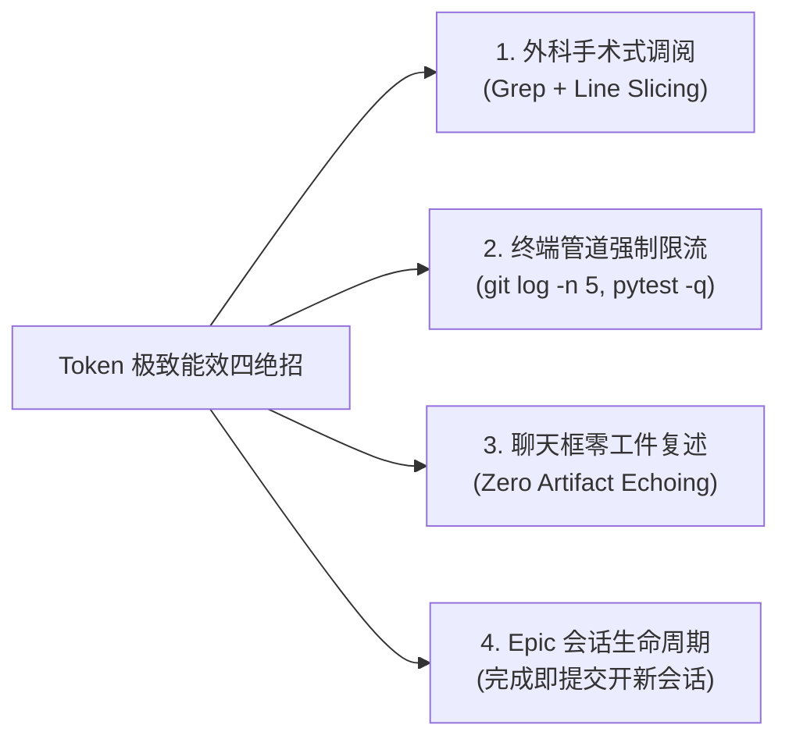

# 02. Token 极致能效与零损耗降本工程手册 (Token Efficiency & Cost Optimization)

> 深度解决大语言模型 Agent 研发中“无效裸读大文件、滚屏日志冲垮上下文、工件二次复述与高额账单”的工业级瘦身与能效指南。

---

## 1. 现象诊断与痛点表征 (Symptoms & Engineering Bottlenecks)

1. **“大水漫灌”式全量读取**：为了改动 3 行逻辑，Agent 调用工具无脑 `view_file` 读取整个 1000 行文件，单次操作浪费上万 Token；
2. **滚屏终端日志冲垮窗口**：执行 `git log`、`npm test` 或运行测试用例时未加限流，几千行编译信息和堆栈直接塞爆上下文，不仅单次计费昂贵，更会永久性污染后续每一轮交互；
3. **工件正文二次复述 (Echoing)**：在 `implementation_plan.md` 或项目文档中生成了详尽的方案后，Agent 竟在聊天流中“原封不动再打一遍”，造成毫无价值的双重计费；
4. **单会话无限膨胀 (Zombie Session)**：一个会话跨越数周，累积了 180K Token 历史包袱。每发一句日常提问，都必须为这 180K 历史上下文买单。

---

## 2. 机理剖析与根因解构 (First-Principles & Root Cause Analysis)

### 2.1 上下文滚雪球计费模型 (The Compounding Cost of Context)
- LLM API 的计费模式是：**每一轮对话消耗的 Token = 本轮输入 + 历史上所有轮次的输入与输出总和**；
- 早期一次无意义的 `10,000 Token` 大文件全量输出，在后续 30 轮对话中会被重复发送 30 次，相当于累计放大了 **300,000 Token** 的计费负担！

### 2.2 Output Token 与 Input Token 的不对称成本
- 顶尖大模型（如 Claude 3.5 Sonnet、GPT-4o、Gemini 1.5 Pro）的 **Output Token 单价通常是 Input Token 的 3~4 倍**，且生成速度直接决定了用户的感知延迟；
- 在聊天框复述工件全文，是典型的“最昂贵、最慢速的垃圾输出”。

### 2.3 Prompt Caching 缓存击穿机制
- 现代大模型均提供了前缀缓存（Prompt Caching），命中文档缓存可享受 75%~90% 的折扣；
- 但如果上下文前部频繁被动态插入临时日志或乱序修改，会导致缓存频繁击穿（Cache Miss），成本翻倍。

---

## 3. 架构防御与治理策略 (Architectural Defense & Strategies)



### 3.1 外科手术式行号切片 (Surgical Line Slicing)
- **铁律**：严禁裸读大文件；
- **战术**：先用 `grep_search` 定位核心关键字与锚点行号，再通过 `view_file(path, StartLine, EndLine)` **将调阅窗口精准收敛在 30~80 行**，单次节省 80%~90% Token。

### 3.2 终端命令管道强制限流 (Command Output Throttling)
- **铁律**：严禁裸跑产生长屏输出的命令；
- **战术**：强制附加限流与静默参数：
  - `git log -n 5 --oneline` (替代 `git log`)
  - `tree -L 2 -I 'node_modules|vendor|.git'` (替代裸 `tree`)
  - `pytest -q -k test_target` (替代全量 `pytest`)
  - `go test -run TestTarget -v` (精准单个用例)

### 3.3 聊天流零工件复述 (Zero Artifact Echoing)
- **铁律**：方案文件写进磁盘后，聊天流只输出标准可点击工件指针（`👉 详见 [plan.md](...)`）与 1~2 个关键待决策卡点；
- **体验加持**：在 macOS CLI 环境下，由系统命令主动唤起预览（`open -a Typora <path>` 或 `open -a "Google Chrome" <path>`），免去打印全文。

### 3.4 静态前置吃满 Prompt Caching
- 全局规则（`GEMINI.md`、`CLAUDE.md`）和 Skills 规范必须保持结构高度静态稳定，常驻在上下文最前缀；
- 确保系统 Prompt Caching 命中率达到 90% 以上。

### 3.5 Epic 会话生命周期管理 (One Epic, One Session)
- 一个主线大任务（Epic）完成后，执行 Conventional Commits 提交代码，高价值避坑总结归档；
- 下一个新任务**坚决开启干净的新会话**，开局 Token 基线瞬间重置为 3K~5K，彻底甩掉 150K 历史包袱。

---

## 4. 多生态跨端落地实现 (Cross-Agent Implementation Matrix)

### 4.1 Google Gemini / agy (Antigravity) 落地配置
在 `GEMINI.md` 注入：
```markdown
- 能效与上下文洁癖：始终奉行 Token 极致能效哲学。查阅代码必带行号切片（严禁裸读大文件），排查脏活必派生子代理隔离，方案工件落盘后绝不在聊天流二次复述。
- 外科手术式调阅与输出限流：
  - 严禁全量裸读大文件：面对超 100 行代码，先 grep 后 view_file(StartLine, EndLine)，窗口控制在 30~80 行；
  - 终端命令强制限流截流：强制附加限流与静默参数 (如 git log -n 5, tree -L 2, pytest -q)。
- 严禁聊天流复述工件正文：仅输出可点击链接并提炼决策点，CLI 环境优先调用 open -a Typora 或 open -a "Google Chrome" 唤起弹窗预览。
```

### 4.2 Anthropic Claude Code 落地配置
在 `CLAUDE.md` 注入：
```markdown
## Token Efficiency Redlines
- NEVER read whole files (>100 lines). Always use `grep` then view specific slice `StartLine`-`EndLine`.
- ALWAYS throttle command line outputs: `git log -n 5`, `tree -L 2`.
- NEVER duplicate markdown plan text in conversation replies. Output the link and open it directly.
```

### 4.3 OpenAI Codex / Operator 落地配置
在 System Prompt 注入：
```markdown
## Output & Context Minimization
- Concise communication: No conversational pleasantries. Provide conclusion, diff, and verification logs.
- Tool usage: Target file reads using line number ranges. Avoid piping entire log streams into conversation memory.
```

### 4.4 Cursor / Windsurf 落地配置
在 `.cursorrules` 或 `.cursor/rules/token-efficiency.mdc` 注入：
```markdown
---
description: Token 能效与上下文控制
globs: **/*
alwaysApply: true
---
- Use targeted symbol search instead of opening entire multi-thousand line files.
- Keep diffs atomic (under 50 lines changed per edit).
- Do not repeat file contents in assistant responses.
```
