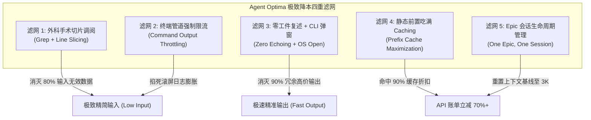

# 02. Token 极致能效与零损耗降本工程手册 (Token Efficiency & Cost Optimization)

> 深度解决大语言模型 Agent 研发中“无效裸读大文件、滚屏日志冲垮上下文、工件二次全量复述与高昂账单”的工业级瘦身与能效白皮书。

---

## 1. 现象诊断与痛点表征 (Symptoms & Engineering Bottlenecks)

在团队或个人高频使用 AI Agent（如 Antigravity、Claude Code、Cursor）时，Token 账单往往以超出预期的速度失控攀升，并伴随显著的推理延迟恶化。经深度审计，80% 的 Token 消耗来自于以下四大典型“高耗低效”反模式：

### 1.1 “大水漫灌”式全量文件读取 (Over-fetching Files)
- **痛点场景**：Agent 为了修改一个函数中的 3 行代码，调用工具无脑 `view_file` 阅读整个 1,200 行的文件。单次调用就灌入 15,000 Token；
- **恶果**：其中 95% 的代码行与当前任务完全无关，不仅白白消耗高额输入费用，而且引入了大量噪音干扰自注意力。

### 1.2 滚屏终端日志冲垮窗口 (Terminal Log Flooding)
- **痛点场景**：执行 `git log`、`npm test`、`docker build` 或全量单元测试时未附加任何限流与过滤参数，成千上万行的构建依赖信息、测试进度条、无用 dump 直接冲入会话记忆；
- **恶果**：瞬间吃掉 30,000~50,000 Token，引发严重的上下文污染，直接将长会话推向 Compaction 悬崖。

### 1.3 昂贵的工件正文二次复述 (Chat Echoing Anti-pattern)
- **痛点场景**：Agent 在磁盘上创建或更新了长达数千字的方案（如 `implementation_plan.md`）或项目架构文档后，竟然在随后的聊天回复流中**原封不动把整篇 Markdown 重新打印一遍**；
- **恶果**：由于 Output Token 单价是 Input Token 的 3~4 倍且生成极慢，这种行为是典型的“最昂贵、最耗时、毫无信息增量”的账单刺客。

### 1.4 僵尸长会话滚雪球包袱 (Zombie Session Compounding)
- **痛点场景**：一个会话连续聊了 5 天，处理了 10 个互不相干的需求，历史 Token 累积至 160K。此后每发一句简单的“帮我给这个函数加个注释”，底层都必须将这 160K 历史上下文完整复算一遍；
- **恶果**：单次简单交互的耗时从 2 秒恶化到 15 秒，每次敲回车都在支付巨额历史债务。

---

## 2. 机理剖析与根因解构 (First-Principles & Root Cause Analysis)

### 2.1 上下文复利计费数学模型 (The Compounding Cost Model)
大语言模型 API 的计费并不是单次独立的，而是**全历史自回归累加**。

设一轮会话中，第 $t$ 轮交互新增输入为 $\Delta I_t$，模型输出为 $O_t$。则第 $N$ 轮交互时，单轮消耗的计费 Token 数量为：

$$\text{Tokens}_N = \left( \sum_{t=1}^{N} \Delta I_t + \sum_{t=1}^{N-1} O_t \right) + O_N$$

- **致命推论**：如果在第 2 轮时，由于一次粗暴的 `git log` 引入了 `20,000` 无效 Token，该错误在后续进行的 20 轮对话中**会被完整重复计费 20 次**，其真实的边际消耗不是 20,000，而是高达 **400,000 Token**！
- **结论**：**在会话早期杜绝一次垃圾数据灌入，收益将在后续每一轮交互中呈复利放大。**

### 2.2 Output Token 与 Input Token 的不对称经济学
主流模型的价格体系存在巨大的结构性差异：

| 模型代号 | Input Token (每百万) | Output Token (每百万) | 输出与输入单价比例 |
| :--- | :--- | :--- | :--- |
| **Claude 3.5 Sonnet** | $3.00 | $15.00 | **5.0 倍** |
| **GPT-4o** | $2.50 | $10.00 | **4.0 倍** |
| **Gemini 1.5 Pro** | $1.25 (<=128K) | $5.00 | **4.0 倍** |

- **关键洞察**：**Output Token 极其金贵！** 聊天框中大段复述长篇 Markdown、输出客套话、复述用户问题，是商业成本上的重大灾难。

### 2.3 Prompt Caching（提示词缓存）的字节级前缀匹配机理
现代顶级 LLM 具备 Prompt Caching 特性。只要上下文序列的**前缀（Prefix）与历史调用完全一致**，缓存命中的 Token 费用直接暴跌至原价的 **10% ~ 25%**（通常降至 $0.30/M），且首字生成时间 (TTFT) 降低 80%。
- **击穿陷阱**：只要在上文前部修改了一个字符、或前缀顺序发生抖动，整个后续缓存全量击穿失效；
- **优化原则**：**绝对的“静态前置、动态后置”**。

### 2.4 为什么 Token 优化绝对不能只做成 Skill？
1. **常态化纪律 vs 可选工具**：
   - 如果做成 Skill，非特定技术任务根本不会激活，而“终端限流”、“行号切片”是每一分每一秒都在发生的操作；
2. **倒贴 Token 的荒谬逻辑**：
   - 一个 Skill 本身就有数百行文档（3,000~5,000 Token）。如果 Agent 每次想要“省 Token”还得先花 5,000 Token 把《省 Token 指南》加载进来，这本身就是严重的负优化；
3. **定位原则**：必须作为**全局宪法级规则 (Rule / System Directive)**，以极高密度（数行以内）刻在顶层。

---

## 3. 架构防御与治理策略 (Architectural Defense & Strategies)



### 3.1 外科手术式切片调阅 (Surgical Line Slicing)
- **铁律**：面对超过 100 行的代码或文档，**坚决禁止无行号全量 `view_file`**；
- **标准调阅两步法 (Two-Step Slicing SOP)**：
  1. **定位**：使用 `grep_search` 精准查找目标类名、函数名或配置常量所在的行号（如第 142 行）；
  2. **收敛**：调用 `view_file(StartLine=120, EndLine=160)`，将调阅窗口**精确收敛在 30~50 行核心上下文**；
- **收益**：单次代码阅读 Token 消耗从 10,000+ 骤降至 500 以内。

### 3.2 终端命令管道强制限流表 (Command Output Throttling Matrix)
执行可能产生长屏输出的命令时，必须强制附加限流与静默参数：

| 工具类别 | ❌ 高危滚屏裸跑 (禁止) | ✅ 规范化限流与静默命令 (强制) | 核心原理解析 |
| :--- | :--- | :--- | :--- |
| **Git 历史** | `git log` | `git log -n 5 --oneline` | 仅取最近 5 次紧凑提交，杜绝全库提交滚屏 |
| **目录拓扑** | `tree` | `tree -L 2 -I 'node_modules\|vendor\|.git'` | 限制层级深度并严格排除巨型依赖目录 |
| **代码检索** | `find . -name "*.go"` | `fd -t f -e go -d 3` | 限制扫描深度，优先使用高性能工具 |
| **Go 测试** | `go test ./...` | `go test -run TestSpecific -v` | 严禁无脑全量跑，只执行当前任务单测 |
| **Python 测试** | `pytest` | `pytest -q -k test_target` | 静默模式输出，屏蔽进度条与无关用例 |
| **Node 测试** | `npm test` | `npm test -- --testPathPattern=target` | 锁定单一测试套件 |
| **Docker 构建** | `docker build .` | `docker build -q .` | 静默模式仅输出最终镜像 ID，拦截构建流水 |

### 3.3 零工件复述与 macOS CLI 自动唤起预览 (Zero Echoing & OS Open)
- **铁律**：在生成或更新了 Markdown 文档、重构方案（`implementation_plan.md`）后，**坚决禁止在对话框中重复打出正文**；
- **对话输出标准**：
  ```markdown
  👉 方案已落盘至 [implementation_plan.md](file:///path/to/plan.md)
  
  核心决策点：
  1. 是否同意采用方案 A（Redis 分布式锁）而非方案 B？
  ```
- **CLI 体验强化**：在 macOS 纯终端（如 `agy`）环境下，Agent 必须主动调用系统命令唤起渲染窗口：
  ```bash
  # 优先调用用户装有 Markdown 插件的浏览器或专业渲染器
  open -a Typora <filepath> || open -a "Google Chrome" <filepath> || open <filepath>
  ```
  实现用户即时可视化审阅，同时节省数千 Output Token。

### 3.4 静态前置与 Prompt Caching 保护
- 系统的全局规则（`GEMINI.md`、`CLAUDE.md`）与通用 Skills 矩阵保持高度静态；
- 严禁动态向 Prompt 头部随机插入时间戳、随机字符或临时任务列表，确保各家大模型底层的 KV Cache 前缀匹配率保持在 **90% 以上**。

### 3.5 Epic 会话生命周期管理 (One Epic, One Session)
- **铁律**：一个会话只服务于一个明确的大任务（Epic）；
- 任务闭环标志：代码实现完成 ➔ 终端编译通过 ➔ 单元测试绿灯 ➔ Conventional Commits 提交代码 ➔ 高价值避坑总结写入知识库；
- **重置动作**：下一个无关需求**坚决开辟新会话**。凭借干净的 Git 历史与 `.agents/PROJECT_MAP.md`，新会话仅需 3K Token 开局基线，彻底摆脱 150K 历史累积包袱。

---

## 4. 多生态跨端落地实现 (Cross-Agent Implementation Matrix)

### 4.1 Google Gemini / Antigravity (agy) 落地配置

在全局总纲 `~/.gemini/GEMINI.md` 中固化：

```markdown
# 1. 交互与语言协议
- 信息密度第一：拒绝车轱辘话。复杂问题优先使用标准分块结构表达 (根本原因/架构思路 -> 核心实现代码 -> 关键点说明)。
- 能效与上下文洁癖：始终奉行 Token 极致能效哲学。查阅代码必带行号切片（严禁裸读大文件），排查脏活必派生子代理隔离，方案工件落盘后绝不在聊天流二次复述。
- CLI 体验与工件自动呈现：在纯终端/CLI 交互环境下，当创建或更新方案或重点复盘后，必须主动调用系统命令自动为用户打开预览 (macOS 优先 open -a Typora 或 open -a "Google Chrome")，彻底免去手动敲命令查找。

# 3. 核心工程铁律
11. 外科手术式调阅与输出限流 (Surgical Slicing & Token Throttling)：
    - 严禁全量裸读大文件：面对超 100 行代码，先 grep 后 view_file(Start, End)，窗口收敛在 30~80 行；
    - 终端命令强制限流截流：必须强制附加限流与静默参数 (如 git log -n 5, tree -L 2, pytest -q)。
12. 严禁聊天流复述工件正文 (Zero Artifact Echoing)：
    - 创建或更新工件后，严禁在回复中重复输出正文。仅输出可点击指针并提炼 1~2 个决策点，CLI 环境主动执行系统 open 命令唤起弹窗预览。
```

---

### 4.2 Anthropic Claude Code 落地配置

在项目根目录 `CLAUDE.md` 中注入：

```markdown
# Token Conservation & Output Discipline

## 1. Targeted Slicing
- NEVER view full files exceeding 100 lines. 
- Workflow: Run `grep` to locate target symbol -> Read precisely 30-50 lines surrounding the match.

## 2. Command Throttling
- NEVER run unrestricted log/status commands.
- Use: `git log -n 5 --oneline`, `tree -L 2 -I 'node_modules|vendor'`, `pytest -q`.

## 3. Zero Echoing
- NEVER repeat file contents or generated plans in conversational output.
- Print file link and open directly using system `open` command on macOS.
```

---

### 4.3 OpenAI Codex / Operator 落地配置

在 System Prompt / Instructions 中固化：

```markdown
## Output Efficiency & Token Optimization

### Strict Output Constraints:
1. No Conversational Fluff: Start directly with root cause analysis, code diff, or verification result.
2. Zero Content Duplication: When you create or update files, provide only the file URI and brief rationale. Do NOT duplicate file contents in the reply.
3. Subprocess Limiting: Always restrict tool execution outputs to a maximum of 30 lines using shell filters (head/tail/grep).
```

---

### 4.4 Cursor / Windsurf 落地配置

在 `.cursor/rules/token-efficiency.mdc` 规则中配置：

```markdown
---
description: Token 能效与上下文限流准则
globs: **/*
alwaysApply: true
---

# Token Efficiency Guidelines

1. Slicing Rule:
   - Use symbol search (@Symbol) instead of reading entire files into context.
   - Keep edit chunks strictly scoped to modified functions (under 40 lines per replacement).

2. Terse Communication:
   - Explain non-obvious engineering decisions only. Avoid narrating obvious syntax changes.
   - Never print long markdown previews in chat if the file has already been saved to the workspace.
```
