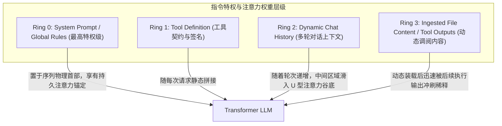

# Agent Optima (⚡ AI Agent 架构优化与多生态生产工程手册)

> 🚀 专为终结大语言模型 Agent 在生产级工程中遭遇的三大痼疾而生：**长会话上下文腐化 (Context Rot)、思维混乱与幻觉代码 (Hallucination)、Token 级数爆炸与高昂账单 (Token Inefficiency)**。
>
> 深度覆盖工业界四大主流 Agent 生态：**Google Gemini (Antigravity/agy) · Anthropic Claude Code · OpenAI Codex/Operator · Cursor/Windsurf**。

[](LICENSE)
[](#)
[](#)

---

## 💡 第一性原理辨析：为什么“上下文治理与 Token 优化”绝不能做成 Skill？

在构建 Agent 工程体系时，一个极具诱惑力但致命的直觉是：*“既然系统支持模块化扩展的 Skill 机制，把长会话防腐化和 Token 优化也封装成一个 Skill（例如 `agent-skill-anti-rot`），让 Agent 按需调用不就行了吗？”*

从 **Agent 的认知心理学、Transformer 自注意力物理机理、计算机体系结构同构性以及上下文能效模型** 进行第一性原理推导，**这种设计在工程逻辑上必然宣告彻底失败**。核心原因包含以下四大公理级支柱：

---

### 1. 触发失能与死锁悖论 (The Trigger Failure & Deadlock Paradox)

* **Skill 的唤醒范式是“被动的、按需的、依赖意图识别的” (Passive, On-Demand, Semantic-Match)**：
  在主流 Agent 架构（ReAct / Reflexion）中，Skill 的装载前置条件是：Agent 必须在主推理循环中对当前目标进行意图解析（Intent Parsing），清晰判断出“当前场景需要某项专业知识”，进而发出工具调用（Tool Call）读取对应的 `SKILL.md`。
* **但上下文腐化（Context Rot）的本质恰恰是“认知基座与元认知能力衰竭” (Cognitive Breakdown)**：
  当长会话累积至 100K+ Token 时，自注意力发生严重稀释与漂移（Attention Drift）。此时的 Agent 表现为：契约遗忘、逻辑打架、意图识别准确率断崖式下跌。
* **致命的死锁逻辑**：
  让一个处于“认知涣散、逻辑混乱”状态的 Agent，去清醒地激活元认知（Metacognition），精准决策并调用《防思维混乱 Skill》来自愈，在概率图模型上构成了**无法自解的循环依赖死锁**。
  > 就像一个因严重醉酒导致意识模糊的司机，你无法指望他凭借清晰的理性在撞车前自主去翻阅手套箱里的《酒后驾驶清醒自律手册》。**底线防御必须是车辆底盘自带的自动紧急制动（AEB），是系统不可违背的本能！**

---

### 2. 上下文污染的“引鸩止渴”反噬 (The Bootstrap Ingestion Paradox)

* **治理目标与执行成本的严重背离**：
  治理上下文与优化 Token 的根本诉求是：**剔除噪音、压缩冗余、提升主上下文的信噪比（Signal-to-Noise Ratio）**。
* **如果做成 Skill 会发生什么？**
  - 一个能够详尽阐述“防腐化 SOP、抗截断重锚机制、切片调阅协议”的专业 `SKILL.md`，其有效内容通常在 300~600 行（消耗 3,000 ~ 6,000 Token）；
  - 当 Agent 已经在 120K Token 的高危临界区苦苦挣扎时，如果此时系统动态将这份巨大的 Skill 塞入上下文，相当于**直接向即将爆满的 RAM 中强行灌入海量元指令**；
  - 这不仅没有降低能耗，反而瞬间吃光剩余安全缓冲，极大概率当场诱发框架的自动截断（Context Compaction），直接抹杀正在进行的业务状态，造成不可逆的记忆崩塌。

---

### 3. 指令权威与注意力层级模型 (Instruction Hierarchy & Attention Decay)

大语言模型对上下文序列中不同来源的 Prompt 存在严格的注意力权重层级差异：



* **Skill 处于最低的 Ring 3 特权级**：
  作为工具读取的外部文本，Skill 注入后处于动态数据层。经过 3~5 轮繁杂的编译报错与代码修改后，它的内容会被无情地冲向 Transformer 的 **“U 型注意力衰减谷底（Lost in the Middle）”**，彻底丧失对模型的约束力；
* **底线规则必须驻留在最高特权级 Ring 0**：
  “严禁裸读大文件”、“必须提供物理编译器通过证据”、“大任务必须落盘断言”，这些属于不可妥协的**系统元宪法（Meta-Constitutional Invariant）**，必须常驻于 System Prompt / 全局 Rules 中，在每次推理周期的物理首部对模型施加强制注意力锚定。

---

### 4. 计算机体系结构同构性：内核硬中断 vs 用户态程序

从计算机体系结构（Computer Architecture）视角进行映射，定位更加泾渭分明：

| 维度 | Skill (专业领域技能) | Rules & Architecture (Optima 架构体系) |
| :--- | :--- | :--- |
| **体系结构映射** | **用户态应用程序 / 动态链接库 (Ring 3 Userland Apps)** | **操作系统内核特权级 / 微码 / MMU (Ring 0 Kernel Invariants)** |
| **典型代表** | `mysql-mastery`、`hyperf-framework`、`go-zero` | 上下文落盘断言、Subagent 隔离、外科手术调阅、Zero Echoing |
| **调用时机** | 仅当编写对应领域的代码时被动装载 | **贯穿每一次工具调用、每一次读写、每一轮对话** |
| **崩溃场景** | 数据库查询写错，卸载该技能不影响系统自愈 | 内核上下文丢失（Kernel Panic），系统彻底停摆崩溃 |
| **设计结论** | **可以插拔、按需调用的业务插件** | **底层虚拟内存管理系统 (VMM) 与指令总线安全协议** |

> **一言以蔽之：**
> 你绝对不能在操作系统发生内存溢出（OOM Panic）的时候，试图从外部磁盘去临时加载一个 Python 脚本来做内存回收。
> **上下文生命周期管理与 Token 能耗治理，必须是操作系统的核心微码与内核常驻守恒机制！**

---

## 🏛️ 核心白皮书矩阵 (Deep-Dive Whitepapers)

本仓库提供工业界最具深度的两大硬核白皮书，均严格依循 **`现象诊断与痛点表征 ➔ 机理剖析与根因解构 ➔ 架构防御与治理策略 ➔ 多生态跨端落地实现`** 四步展开，涵盖完整数学推导、状态机图谱与开箱即用的配置代码：

```text
agent-optima/
├── README.md                                  # 核心哲学、架构第一性原理与体系总纲
├── LICENSE                                    # Apache 2.0 开源协议
│
├── 01-context-architecture-and-anti-rot.md    # 📘 深度白皮书：长会话抗腐化与思维防混乱工程指南
├── 02-token-efficiency-and-cost-optimization.md # 📗 深度白皮书：Token 极致能效与零损耗降本手册
│
└── adapters/                                  # 🌐 四大主流生态即插即用生产级实装配置
    ├── gemini/README.md                       # Google Gemini (Antigravity/agy) 规则与断言配置
    ├── claude/README.md                       # Anthropic Claude Code CLAUDE.md 与 Subagent 隔离
    ├── codex/README.md                        # OpenAI Codex / AGENTS.md 行为树约束
    └── cursor/README.md                       # Cursor / Windsurf .cursor/rules/*.mdc 体系
```

---

## 🚀 架构治理矩阵全景速览

| 治理维度 | 传统平庸 Agent 痛点与反模式 | Agent Optima 工业级硬核解决方案 | 质变预期收益 |
| :--- | :--- | :--- | :--- |
| **任务状态驻留** | 仅驻留在会话短期 RAM，长会话压缩截断后记忆全失 | **外部磁盘强制落盘 (State Externalization)**：微任务拆解写入专属工件，实时同步勾选 | **彻底杜绝中后期失忆、重复推倒与逻辑打架** |
| **上下文截断恢复** | 依赖系统生成的模糊自然语言摘要，凭空脑补虚构细节 | **压缩读盘逆向重锚 (Compaction Rehydration Gate)**：截断后第一动作强制读盘对齐物理基线 | **终结凭幻觉推演，瞬间恢复 100% 精确工程坐标** |
| **海量脏数据处理** | 数十个文件全量检索、数千行构建/测试日志直接丢入主会话 | **Subagent 阅后即焚隔离 (Ephemeral Isolation)**：脏活派生子代理消化，主会话仅收 20 行高纯度结论 | **主会话永远保持极高信噪比，上下文无污染** |
| **代码交付验收** | 盲目假设任务成功，或为省 Token 阉割全量回归测试 | **物理编译与全量回归硬门禁 (Verification Evidence Gate)**：开发期定向微测，交付前必须全量回归，测试真实执行且退出码为 0 | **彻底终结跨模块破坏性回归缺陷** |
| **源码文件调阅** | 无脑全量裸读大文件，或机械切断完整函数上下文 | **完整语义单元调阅 (Semantic Slicing)**：先代码搜索定位，再完整调阅函数/类闭包，大文件设预算上限 | **兼顾上下文完整性与 Token 节约** |
| **终端命令交互** | 裸跑大命令滚屏冲垮上下文，或盲目限制测试命令 | **日志重定向截流与限流矩阵**：全量测试重定向至文件仅提取摘要，常规命令附加静默/限制参数 | 📉 **终端日志交互 Token 消耗大幅削减** |
| **工件呈现与反馈** | 生成文档后在聊天流把千字 Markdown 原样打出一遍 | **零工件复述 (Zero Artifact Echoing)** + macOS CLI 自动调起 Typora / Chrome 弹窗渲染 | 📉 **大幅削减最昂贵的 Output Token 消耗** |
| **生命周期控制** | 一个会话跨越数周，持续背负 180K 沉重历史包袱 | **One Epic, One Session 机制**：大任务闭环即提交推送，新任务 3K 轻装基线出发 | 📉 **消除 $O(N^2)$ 累计输入膨胀，降低边际成本** |
| **多维诉求与杂项干扰** | 周报、技术栈科普、发散想法堆积在主开发会话，严重稀释核心注意力 | **信息四级分级与阅后即焚 (Lifecycle Triage)**：瞬态小工具即焚，调研落盘沉淀知识库，周报外置交付，主会话保持绝对聚焦 | **杜绝意图漂移，主会话零上下文毒化** |

---

## 📜 授权许可

本项目遵循 [Apache 2.0 License](./LICENSE) 协议，面向全球 AI 开发者与智能体架构师开源共享。
